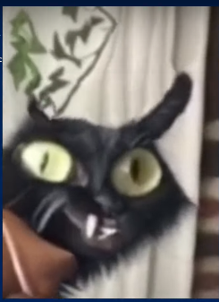

1. Необходимо смотреть на концепции трендов (челлендж, один день и т.д.);

2. Идеи со стримов;

3. Выбрать язык аудитории;

4. Взаимодействие человека в кадре;

5. Смена кадров каждые 3-5 секунд; 

6. Элемент соревнования;

7. Ориентация на хайлайты (пафос);

8. Right version;

9. Тарантиновские диалоги;

10. НЕ ЛЕЗЕМ В ТРЕНДЫ; 

11. разработка игр в формате сериала; 

12. 

13. Озвучка;